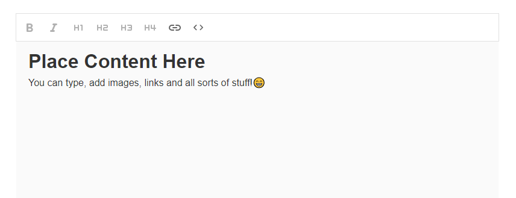

# React WYSIWYG Editor



A simple WYSIWYG (What You See Is What You Get) editor built using React.

## Features and goals

- **Content Editing**: Edit text, add images, and format content easily.
- **Text Formatting**: Bold, italic, underline, and more formatting options.
- **Insert Media**: Add images and links seamlessly.
- **Responsive**: Works well on desktop and mobile browsers.
- **Customization**: Easily extendable and customizable.

## Installation

To run this project locally, clone the repository and run the following commands:

```bash
git clone https://github.com/Ruffmantom/wysiwygTextEditor.git
cd react-wysiwyg-editor
npm install
npm start
markdown
Copy code
```
Usage
Open the editor in your browser.
Start editing content directly in the WYSIWYG interface.
Use toolbar options to format text, add links, and insert media.
Save or use the edited content as needed.
License
This project is licensed under the MIT License - see the LICENSE file for details.

Contributing
Contributions are welcome! Please feel free to submit a pull request.

Acknowledgments
Built with React
Icons from Material Icons
Support
For support, contact tomruffcodes@gmail.com.